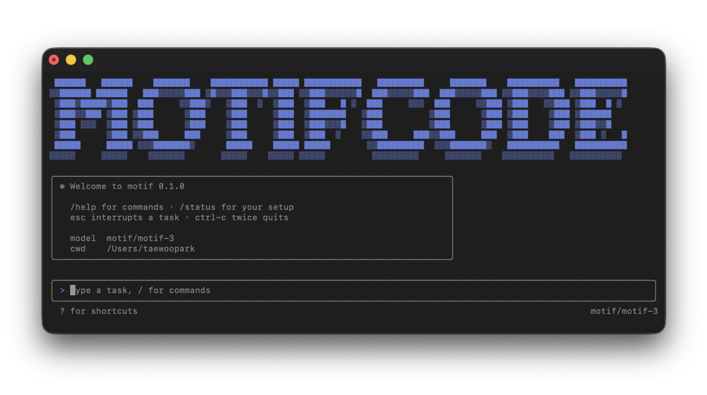
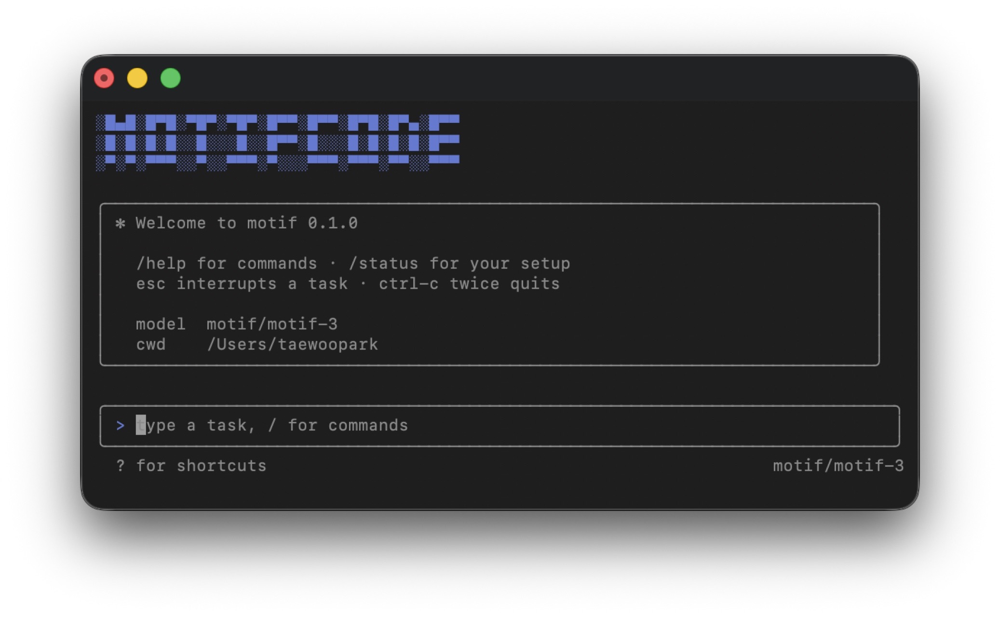
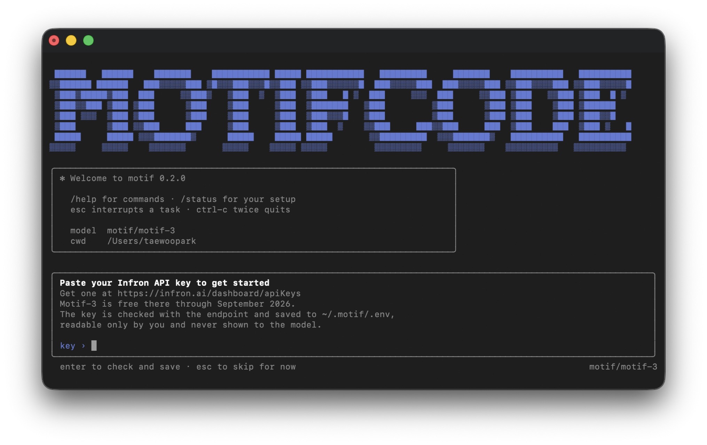
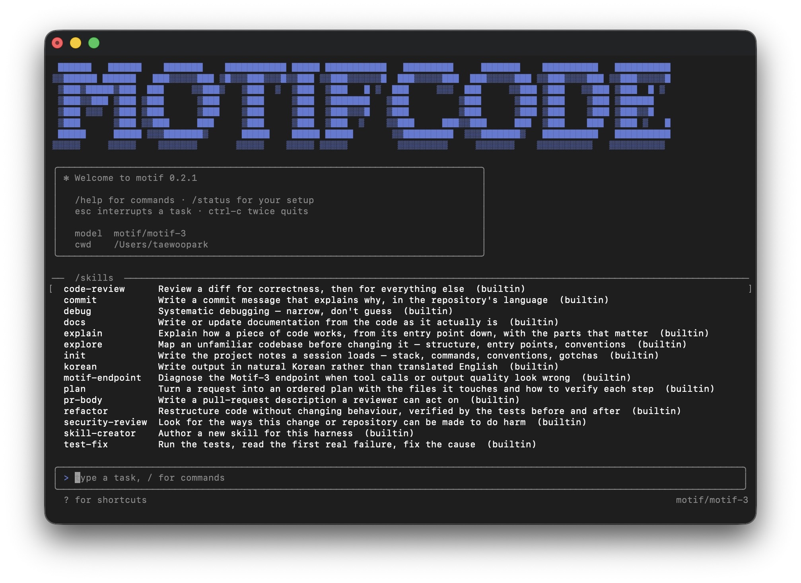
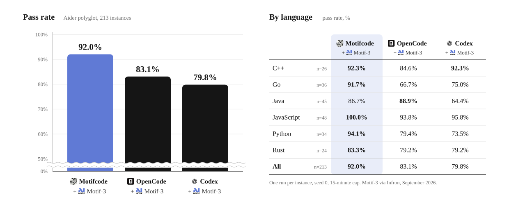

<p align="center">
  
</p>

<p align="center">
  <strong>단 하나의 모델, Motif-3를 위해 만든 코딩 에이전트 하네스.</strong>
</p>

<p align="center">
  <a href="README.md">English</a> &nbsp;·&nbsp; 한국어
</p>

<p align="center">
  
  
  
  
  &nbsp;
  
  
  
  &nbsp;
  
  
  
  
</p>

<p align="center">
  <a href="https://discord.gg/5d99wCtzc"></a>
</p>

> **2026년 9월까지 무료.** Motif-3는 [Infron](https://infron.ai)에서 **Motif: Motif 3 (Free)** 로
> 제공됩니다. 입력·출력 모두 100만 토큰당 $0, 262,144 토큰 컨텍스트 전체가 열려 있고,
> 2026년 9월 말까지 무료 제공이 공지되어 있습니다. 계정과 API 키만 있으면 됩니다.
> `npx motifcode`가 키를 물어본 뒤 `motif` 명령까지 설치해 줍니다.
> 조건은 바뀔 수 있으며, [모델 페이지](https://infron.ai/models/motif/motif-3)가 기준입니다.

> **Motif 공식 프로젝트가 아닙니다.** Motifcode는 독립적인 오픈소스 프로젝트입니다.
> 모티프테크놀로지스(Motif Technologies)나 Infron이 인증·보증·후원·관리하는 저장소가
> 아닙니다. *Motif*와 *Motif-3*는 그들의 이름이고, 이 저장소는 그 모델의 클라이언트일 뿐입니다.

Motifcode는 Claude Code의 모양을 한 터미널 코딩 에이전트입니다. 위에는 대화 기록,
아래에는 테두리가 있는 프롬프트, `/` 명령, `@` 멘션, 권한 확인 창, 그리고 뒤에는
`.motif/` 디렉터리가 있습니다. 다만 도구 집합, 프롬프트 배치, 파서, 실패 처리 방식은
전부 **[Motif-3](https://huggingface.co/Motif-Technologies/Motif-3)에 대해 구체적으로
참인 사실들의 결과**이고, 그 대부분은 가정이 아니라 측정으로 얻은 것입니다. 범용
하네스에 base URL만 바꿔 끼운 것이 아닙니다.

<br>

<p align="center">
  
</p>

---

## 왜 만들었는가

2026년 8월 18일, 과학기술정보통신부는 **독자 AI 파운데이션 모델** 프로젝트의 2차
단계평가 결과를 발표했습니다. 네 팀이 평가를 받았고 LG AI연구원, SK텔레콤,
업스테이지가 다음 라운드로 올라갔으며, **모티프테크놀로지스는 탈락**했습니다. 네 팀
가운데 벤치마크 점수가 가장 높았는데도요. 차관의 설명은 *"기술력은 뛰어났지만
사용성·활용성 부분에서 다른 기업에 비해 다소 낮은 평가를 받았다"* 는 것이었습니다.
그 일주일 전에 Motif-3는 오픈 웨이트로 공개되어 Artificial Analysis 지능 지수 47점으로
국내 모델 1위를 기록한 참이었습니다.
([디일렉](https://www.thelec.kr/news/articleView.html?idxno=61033),
[비즈한국](https://bizhankook.com/articles/motif-eliminated-doks-round-3-change.html),
[헬로티](https://www.hellot.net/news/article.html?no=114379);
현재는 점수체계 변경으로 34점으로 재조정되었음)

코딩 모델의 *사용성*은 대부분 가중치의 속성이 아닙니다. 모델이 내보낸 도구 호출이
파싱되는가, 프롬프트가 모델 자신의 채팅 템플릿이 기대하는 순서로 배치되는가, 한 번
깨진 턴을 고쳐서 이어 가는가 아니면 그대로 세션이 끝나는가, 손에 쥐어 준 도구가 그
모델이 점수를 냈던 바로 그 도구인가, 그리고 사람 앞에 놓인 터미널이 이미 쓰고 있는
도구들처럼 움직이는가. 이 전부가 하네스의 속성이고, 하네스는 누구나 쓸 수 있습니다.

**Motifcode는 오픈 웨이트 모델이 감점당한 그 사용성을 오픈소스로 충분히 끌어올릴 수
있다는 것을 입증하기 위해 만들어졌습니다.** 이 하네스는 이 모델 하나를 위해 쓰였고,
이 모델을 상대로 측정되었으며, Claude Code의 대화형 세션과 기능 하나하나를 맞대어
검증한 세션을 갖추고 있습니다.

---

## 어떻게 생겼는가

<table>
  <tr>
    <td width="50%" align="center" valign="top">
      <br>
      <sub><b>넓은 창.</b> 히어로, 환영 카드, 프롬프트.</sub>
    </td>
    <td width="50%" align="center" valign="top">
      <br>
      <sub><b>좁은 창.</b> 히어로는 창에 맞는 크기로 바뀌고, 세션은 같습니다.</sub>
    </td>
  </tr>
  <tr>
    <td width="50%" align="center" valign="top">
      <br>
      <sub><b>첫 실행.</b> 프롬프트 자리에서 Infron API 키를 물어보고, 확인한 뒤 한 번만 저장합니다.</sub>
    </td>
    <td width="50%" align="center" valign="top">
      <br>
      <sub><b><code>/skills</code>.</b> 내장 스킬 목록. 각각 <code>/commit fix the parser</code>처럼 명령으로도 실행됩니다.</sub>
    </td>
  </tr>
</table>

히어로는 창 너비에 맞춰 바뀌고, 환영 카드는 무엇을 치면 되는지 알려 주며, 첫 실행은
프롬프트 자리에서 키를 물어봅니다. 세션 안에서 내가 친 줄은 `>` 뒤에, 모델의 말과
도구 호출은 `⏺` 뒤에, 결과는 `⎿` 아래에 놓이고, 추론 과정은 요청하지 않는 한
숨겨집니다. 상태 줄은 쓰인 컨텍스트와 서버가 캐시에서 꺼내 준 프롬프트 비율을 보여
줍니다.

---

## 설치와 사용법

**Node 20.3 이상**이 필요합니다. 패키지는 런타임 의존성이 없는 파일 하나입니다.

```bash
cd your-project
npx motifcode          # 첫 실행: 키를 물어본 뒤 `motif` 명령 설치까지 해 줍니다
```

첫 세션에서 Infron API 키를 한 번만 물어보고 `~/.motif/.env`에 저장합니다. `npx`는
명령을 남기지 않으므로 이어서 `npm install -g motifcode`를 대신 실행해 줄지
물어봅니다. 예라고 하면 그다음부터는 어느 폴더에서든 `motif`(또는 `motifcode`)로
세션을 엽니다. 처음부터 `npm install -g motifcode`를 직접 해도 같은 결과입니다.

| 명령 | 하는 일 |
|---|---|
| `motif` | 현재 디렉터리에서 대화형 세션을 연다 |
| `motif --continue` | 같은 세션을, 이 저장소의 최근 대화를 불러온 채로 연다 |
| `motif "<작업>"` | 작업 하나를 실행하고 종료; `--interactive`를 붙이면 끝난 뒤 세션에 남는다 |
| `motif -p "<질문>"` | 최종 답변만 출력; 스크립트와 파이프용 |
| `motif login` · `motif logout` | 세션 밖에서 키 입력; 저장된 키 삭제 |
| `motif doctor` | 엔드포인트 점검: 인증, 도구 호출·추론 파서, 프리픽스 캐시, 채널 |
| `motif mcp add NAME -- COMMAND [ARGS...]` | 로컬 stdio MCP 서버 등록 |
| `motif mcp presets [ID]` · `install ID` | 내장 프리셋 조회와 오프라인 등록; `--enable`로 활성화 |
| `motif mcp add NAME --transport http URL` | Streamable HTTP MCP 서버 등록; 기존 SSE는 `sse` 지정 |
| `motif mcp list` · `get NAME` · `doctor --connect` | MCP 설정 조회와 실제 연결 진단 |
| `motif mcp enable NAME` · `disable NAME` · `remove NAME` | 저장된 MCP 등록 활성화·비활성화·삭제 |
| `motif mcp connect NAME --login` · `login NAME` · `logout NAME` | 연결 확인, 브라우저 로그인과 로컬 OAuth 자격 증명 삭제 |
| `motif plugins inspect NAME` · `connect NAME --login` | 설치한 스킬 패키지의 서비스 검토·승인·연결 |
| `motif mcp import codex\|claude PATH` | 다른 클라이언트의 서버 설정 미리보기; `--write NEW_PATH`로 비활성 항목 저장 |
| `motif sessions` · `motif resume <file>` | 기록된 세션 목록; 중단된 세션 이어 가기 |
| `motif skills` · `agents` · `plugins` · `config` | 로드된 것들, 그리고 유효한 설정과 각각의 출처 |
| `motif skills add` · `import` · `marketplace` | 로컬·Git·Claude·Codex·마켓플레이스에서 선택한 스킬 설치 |
| `motif trust` | 이 저장소의 `.motif/settings.json` 훅을 승인 |

플래그: `--model`, `--endpoint`, `--env-file`, `--theme`, `--thinking`,
`--verbose`, `--permissions ask|auto`, `--cwd`, `--channel`, `--max-turns`,
`--max-output-tokens`, `--seed`, `--no-hero`. 전체 목록은 `motif --help`에 있습니다.
`mcp`, `skills`, `plugins` 명령은 [MCP 서버](#mcp-서버)와 [스킬](#스킬)에서 자세히 설명합니다.

---

## MCP 서버

MCP 서버를 연결하면 Motif가 바깥 도구를 쓸 수 있습니다. 라이브러리 문서, GitHub,
브라우저, 직접 만든 로컬 서비스 같은 것들입니다. stdio, Streamable HTTP, 기존 SSE
서버를 지원합니다. 모든 서버는 `mcp` 도구 하나 뒤에 있어서, 서버를 연결해도 모델의
도구 목록은 바뀌지 않습니다. 각 서버 도구는 자기 이름과 JSON Schema로 호출되고,
인자는 보내기 전에 검사합니다. 서버 도구에도 세션 권한이 그대로 적용되며, 결과를
알 수 없는 쓰기 작업은 스스로 다시 실행하지 않습니다.

### 기본 제공 프리셋

프리셋 8개가 함께 들어 있습니다. 목록은 오프라인으로 볼 수 있고, 등록해도 무언가를
내려받거나 실행하거나 로그인하지 않습니다.

| 프리셋 | 추가되는 것 | 연결 방식 | 필요한 것 |
|---|---|---|---|
| `context7` | 최신 라이브러리·프레임워크 문서 | HTTP | 없음; API 키는 계정 한도를 늘릴 때만 필요 |
| `github` | 저장소, 이슈, PR, 워크플로 | HTTP | GitHub CLI(`gh`); `gh`에 저장된 계정을 그대로 사용 |
| `playwright` | 브라우저 이동과 페이지 확인 | stdio (`npx`) | Node/npm과 Chrome; 격리된 프로필로 headless 실행 |
| `filesystem` | 지정한 폴더 안의 파일 도구 | stdio (`npx`) | 직접 고른 기존 폴더 |
| `hugging-face` | 공개 모델·데이터셋·저장소 정보 | HTTP | 없음; 인증이 필요한 기능에는 Hugging Face 토큰 |
| `openai-docs` | OpenAI 개발자 문서 | HTTP | 없음 |
| `tauri` | Tauri 앱 확인(커뮤니티 서버) | stdio (`npx`) | MCP 브리지 플러그인을 넣고 실행 중인 Tauri 2 앱 |
| `gmail` | Gmail(미리보기) | HTTP | 직접 준비한 Google OAuth 액세스 토큰; 내장 로그인 없음 |

`npx` 프리셋은 첫 연결 때 버전이 고정된 패키지를 내려받습니다. 자세한 조건은
[프리셋별 요구 사항](docs/mcp.md#built-in-server-presets)을 참고하세요.

### 서버 추가하기

**세션 안에서.** `/mcp`를 입력하면 등록된 서버와 추가할 수 있는 프리셋이 나옵니다.
프리셋을 고르면 필요한 것과 저장 위치를 보여 주고, 확인하면 등록과 연결까지 마칩니다.
재시작 없이 같은 세션에서 바로 그 도구를 쓸 수 있습니다. `/mcp list`,
`/mcp connect NAME`, `/mcp disconnect NAME`, `/mcp reconnect NAME`,
`/mcp login NAME`으로 프롬프트에서 직접 제어할 수도 있습니다.

**셸에서 프리셋 등록.**

```bash
motif mcp presets                                  # 프리셋 목록 (오프라인)
motif mcp presets playwright                       # 프리셋 하나의 요구 사항
motif mcp install context7 --enable
motif mcp install filesystem --root /absolute/project/path --enable
motif mcp install github --enable && motif mcp login github
```

`install`은 등록만 하며, `--enable`이 없으면 비활성 상태로 저장합니다.

**그 밖의 서버.** Motif 옵션은 `--` 앞에, 서버 실행 명령은 그 뒤에 씁니다.
HTTP·SSE 서버는 URL을 받습니다.

```bash
motif mcp add local -- node /absolute/path/to/server.mjs
motif mcp add local-api --env-ref TOKEN=SERVICE_TOKEN -- node /absolute/path/to/server.mjs
motif mcp add docs --transport http https://developers.openai.com/mcp
motif mcp add remote --transport http --header 'Authorization=Bearer ${SERVICE_TOKEN}' https://example.com/mcp
motif mcp add legacy --transport sse --header-env X-Api-Key=SERVICE_TOKEN https://example.com/sse
```

인증 정보는 값 대신 환경 변수 참조(`--env-ref`, `--header-env`, `${VAR}`)로 넘기세요.
비공개 헤더에는 참조만 쓸 수 있습니다. 등록은 `~/.motif/mcp.json`에 저장되며,
[직접 편집](docs/mcp.md#configuration-and-trust)할 수도 있습니다.

**Codex·Claude 설정에서 가져오기.**

```bash
motif mcp import codex ~/.codex/config.toml
motif mcp import claude /path/to/claude-config.json --write ./mcp.imported.json
```

`--write`로 새 파일을 지정하기 전까지는 미리보기만 합니다. 가져온 항목은 검토할 수
있도록 비활성 상태로 남고, 설정에 직접 적힌 비밀값은 복사하지 않습니다.

**요청으로.** 서버의 저장소나 URL과 함께 명확하게 요청하면 내장 `mcp-setup` 스킬이
이어받습니다.

> https://github.com/TaewoooPark/Trendchaser-mcp 이 MCP를 motifcode에 연결해줘. 연결되는지도 확인해줘.

서버의 설치 문서를 읽고, 평소 권한 안에서 등록과 연결 확인을 진행합니다.
`/mcp-setup <URL>`로 직접 실행할 수도 있습니다.

### 로그인과 연결 확인

```bash
motif mcp list                       # 등록된 서버와 프리셋 (오프라인)
motif mcp doctor --connect           # 활성 서버를 시작해 도구 목록을 확인한 뒤 닫음
motif mcp connect NAME --login       # 연결하고, 필요하면 브라우저로 로그인
motif mcp login NAME --no-browser    # 브라우저 대신 로그인 URL을 출력 (SSH·headless 환경)
```

표준 MCP OAuth를 쓰는 서버는 브라우저로 로그인합니다. Motif가 제공자의 로그인
페이지를 열고, loopback 포트로 콜백을 받은 뒤, 토큰을 `~/.motif/auth` 아래의 비공개
파일에 보관합니다. `mcp.json`이나 모델 컨텍스트에는 들어가지 않습니다. 세션 안에서는
로그인이 필요한 서버가 로그인을 제안하고, 브라우저가 열리지 않을 때를 위해 패널에
URL도 보여 줍니다. GitHub 프리셋은 대신 GitHub CLI에 저장된 계정을 빌려 씁니다.
Motif는 위임 기록만 남기고 토큰은 `gh`가 보관하며, 재시작해도 로그인이 유지됩니다.
`motif mcp logout NAME`은 Motif의 인증 정보만 지우고, 제공자나 `gh`의 로그인은 그대로
둡니다.

`~/.motif/mcp.json`은 신뢰된 설정입니다. 프로젝트 안의 설정 파일은 자동으로 읽지
않습니다. 파일을 검토한 뒤 `--mcp-config FILE`과 함께, 그때 출력되는 SHA-256을
`--trust-mcp`로 넘기세요. `/mcp`에서 추가한 서버는 바로 연결되고, 다른 터미널에서
수정한 설정은 재실행해야 반영됩니다. 도구 허용 목록, 타임아웃, 폼·URL 승인과 전체
지원 범위는 [MCP 사용 안내](docs/mcp.md)에 있습니다.

---

## 스킬

스킬은 `SKILL.md`(`name`과 `description`이 담긴 YAML 프런트매터, 그 아래 지시문)와
그 옆에 둔 스크립트·참조 문서·자료로 이루어진 폴더입니다. Claude Code와 Codex가 쓰는
Agent Skills 형식 그대로이며, Motif는 두 클라이언트의 방식을 모두 읽습니다. 시스템
프롬프트에는 짧은 목록만 들어가고, 스킬 본문은 쓸 때 불러옵니다.

내장 스킬 18개와, 워크플로 번들 5개에 담긴 스킬 6개가 함께 들어 있습니다.
`/<이름> [입력]`(`/commit fix the parser`)으로 실행하거나, `@skill:이름`으로
첨부하거나, 모델이 `skill` 도구로 직접 고르게 둘 수 있습니다. `/skills`는 로드된
스킬을 보여 줍니다.

### Claude Code·Codex 호환

| 원본 스킬의 요소 | Motif에서 |
|---|---|
| `SKILL.md` 프런트매터, 참조 문서, 스크립트, 자료 | 스킬 자신의 폴더를 기준으로 불러옴 |
| `$ARGUMENTS`, `$ARGUMENTS[N]`, `$N` | 명령 뒤의 입력으로 채움; 따옴표로 묶은 말은 한 덩어리로 유지 |
| `${CLAUDE_SKILL_DIR}`, `${CLAUDE_PLUGIN_ROOT}` | 스킬 폴더, 그리고 패키지로 설치했다면 그 패키지 루트 |
| Claude `disable-model-invocation`, `user-invocable` | 그대로 적용: 사용자만 호출하거나, 사용자 목록에서 숨김 |
| Codex `agents/openai.yaml`의 `allow_implicit_invocation: false` | 사용자만 호출 |
| Claude `allowed-tools` | 안내와 함께 보존; Motif 권한을 주지는 않음 |
| `.claude-plugin/marketplace.json`, `.agents/plugins/marketplace.json` | 두 클라이언트의 카탈로그를 모두 조회 |
| 호스트 전용 훅, fork, 모델 전환 | 지원하지 않는다고 알림; 일부만 흉내 내 실행하지 않음 |

### 스킬 추가하기

**요청으로.** 스킬 링크와 함께 명확하게 요청하면 내장 `skill-setup`이 출처를 확인하고,
설치한 뒤 검증까지 합니다.

> https://github.com/anthropics/skills/tree/main/skills/webapp-testing 이 스킬을 이 프로젝트에 설치해줘.

"글로벌로" 또는 "모든 프로젝트에서 쓰게" 설치해 달라고 하면 `~/.motif/`에 설치되어
모든 프로젝트에서 쓸 수 있습니다. `/skill-setup <출처 또는 요청>`으로 직접 실행할 수
있고, 이미 가진 Claude·Codex 스킬을 가져올 때도 씁니다.

**링크·저장소·폴더에서.**

```bash
motif skills add https://github.com/anthropics/skills/tree/main/skills/webapp-testing
motif skills add https://github.com/anthropics/skills/blob/main/skills/brand-guidelines/SKILL.md --scope project
motif skills add anthropics/skills --path skills/webapp-testing
motif skills add ./my-skill --scope project
motif skills inspect ./my-skill                    # 설치하지 않고 미리보기
```

GitHub 폴더·`SKILL.md`·raw 링크는 스킬 폴더 전체를 설치합니다. `--ref`로 브랜치·태그·
커밋을 고정하고, `--dry-run`으로 미리 볼 수 있습니다. 설치할 때마다 확인된 커밋과
내용 digest를 기록합니다.

**Claude Code·Codex에서.**

```bash
motif skills import claude                         # 후보 목록만 보여 주고, 아직 복사하지 않음
motif skills import codex --json
motif skills import claude --skill webapp-testing --scope project
```

Claude 가져오기는 `~/.claude/skills`, 프로젝트의 `.claude/skills`, Claude Code에서
켜 둔 플러그인을 읽습니다. Codex 가져오기는 `~/.agents/skills`, `~/.codex/skills`,
프로젝트부터 Git 루트까지의 `.agents/skills`, Codex에서 켜 둔 플러그인을 읽습니다.
스킬은 Motif 자체 저장소로 복사되며, 다른 클라이언트의 파일과 설정은 건드리지
않습니다.

**마켓플레이스에서.**

```bash
motif skills marketplace OWNER/CATALOG
motif skills add OWNER/CATALOG --plugin ENTRY --skill SKILL_NAME
```

**MCP 서버가 딸린 플러그인 패키지.** `motif plugins add OWNER/REPO --skill NAME`으로
스킬을 설치하고, `motif plugins inspect NAME`으로 딸린 서버를 확인한 뒤,
`motif plugins connect NAME --login`으로 승인하면 등록과 연결을 진행합니다. 다른
호스트용 훅·에이전트·명령은 켜지지 않습니다. `/plugin-setup <출처 또는 요청>`으로
요청해도 같은 과정을 거칩니다.

**직접 작성하기.** 모든 프로젝트용은 `~/.motif/skills/<이름>/SKILL.md`, 한 프로젝트용은
`<project>/.motif/skills/<이름>/SKILL.md`에 만듭니다. `/skill-creator`가 초안을 써 줄
수 있습니다.

```markdown
---
name: explain-widget
description: Explain this project's widget lifecycle and check its invariants.
---

Read references/lifecycle.md relative to this skill's directory.
Explain the widget named in $ARGUMENTS, citing the relevant source.
```

설치한 사본은 `motif skills installed`, `motif skills update NAME`,
`motif skills remove NAME`으로 관리합니다. 새로 설치한 스킬은 실행 중인 세션을 다시
시작해야 로드됩니다. 우선순위 규칙과 전체 호환 표는 [스킬 문서](docs/skills.md)에
있습니다.

### 내장 워크플로 번들

플러그인 5개가 함께 들어 있습니다. 번들 스킬은 모든 프로젝트에서 슬래시 명령으로
실행되고, 지시문과 참조 문서는 쓸 때만 불러옵니다. MCP 서비스와 연결된 번들은 그
서버가 켜져 있을 때만 모델의 스킬 목록에 오릅니다. 사용자·프로젝트 스킬로 덮어쓸 수
있고, 플러그인 목록을 봐도 서비스가 시작되지는 않습니다.

| 번들 | 스킬 | 선택 서비스 |
|---|---|---|
| `library-docs` | `/library-docs` | Context7 |
| `browser-web-testing` | `/browser-testing` | Playwright |
| `github-workflow` | `/github-workflow` | GitHub MCP 또는 로그인된 `gh` CLI |
| `frontend-quality` | `/frontend-quality`, `/react-composition` | Context7, Playwright |
| `mcp-builder` | `/mcp-builder` | 개발 중인 서버 |

```bash
motif plugins list
motif plugins inspect library-docs --json
motif plugins connect library-docs
```

번들 서비스 연결은 따로 승인하는 단계이며, 비대화형 셸에서는 검토한 계획을 `--yes`로
확정합니다. 기존 등록은 그대로 두고, 번들을 쓸 수 있다고 해서 서비스에 로그인된 것은
아닙니다. 자세한 내용은 [내장 워크플로](docs/skills.md#built-in-workflow-bundles)를
참고하세요.

---

## Infron에서 API 키 발급하기

Motif-3는 Infron의 OpenAI 호환 엔드포인트로 접근합니다. 설정 전체는 base URL, 모델
id, 키 세 가지입니다.

| | |
|---|---|
| base URL | `https://llm.onerouter.pro/v1` |
| 모델 | `motif/motif-3` |
| 키 | `MOTIF_API_KEY` |

1. **[infron.ai/login](https://infron.ai/login)** 에서 이메일이나 Google로 로그인합니다.
2. **[Dashboard → API Keys](https://infron.ai/dashboard/apiKeys)** 를 열고 **Add new key** 를 누릅니다.
3. `motif`를 실행하고, 물어볼 때 키를 붙여 넣습니다. 토큰 하나짜리 요청으로
   엔드포인트에 확인한 뒤 `~/.motif/.env`에 저장되고(본인만 읽을 수 있는 권한),
   모델에게는 절대 보여 주지 않습니다. 세션 밖에서는 `motif login`이 같은 일을
   하고, 세션 안에서는 `/login`과 `/logout`이 있습니다. 환경 변수의
   `MOTIF_API_KEY`나 프로젝트 옆의 `.env`도 되고, `--env-file <경로>`는 그 파일을
   가장 먼저 읽게 합니다.
4. `motif doctor`가 연결을 확인하고, 서버가 도구 호출과 추론을 어떤 형태로
   돌려주는지와 프리픽스 캐시가 켜져 있는지를 보고합니다.

**2026년 9월까지 무료.** 이 글을 쓰는 시점에 Infron은 이 모델을 *Motif: Motif 3
(Free)* 로, 입력·출력 모두 100만 토큰당 $0로 올려 두었고, 2026년 9월 말까지 무료
제공을 공지했습니다. 현재 조건은 [모델 페이지](https://infron.ai/models/motif/motif-3)와
Infron의 [무료 모델 약관](https://infron.ai/docs/overview/free-models)에서 확인하세요.

`.env` 파일에서는 `MOTIF_*` 키만 읽고, 어느 것도 환경 변수로 내보내지 않으며, 무엇이든
실행되기 전에 하네스 자신의 환경에서도 키를 지웁니다. 모델의 `bash`도, 프로젝트 훅도
키를 볼 수 없습니다.

---

## 명령과 단축키

| 명령 | 하는 일 |
|---|---|
| `/help` | 명령과 단축키 |
| `/status` (`/cost`) | 연결, 설정, 세션 누적치 |
| `/config` | 대시보드에서 설정 변경; `/config show`로 값과 출처 확인 |
| `/stats` | 로컬 세션 기록의 작업·도구 통계 |
| `/usage` | Infron 잔액, 기록된 토큰 사용량과 요청 비용 |
| `/doctor` | 엔드포인트 점검: 인증, 파서, 캐시, 채널 |
| `/mcp [list\|connect NAME\|disconnect NAME\|reconnect NAME\|login NAME\|logout NAME]` | MCP 관리 화면에서 프리셋 추가, 연결 상태 조회·제어와 로그인 |
| `/mcp-setup <URL>` | 내장 스킬로 MCP 서버 등록과 연결 확인 |
| `/login`, `/logout` | Infron API 키를 붙여 넣어 확인 후 `~/.motif/.env`에 저장; 저장된 키 삭제 |
| `/model [id]`, `/endpoint [url]` | 다음 작업에 쓸 모델 id나 엔드포인트를 보거나 바꿈 |
| `/channel [toolcall\|object\|raw]` | 행동 채널을 보거나 바꿈; 바꾸면 대화가 새로 시작됨 |
| `/max-turns [n]`, `/max-tokens [n\|off]`, `/seed [n\|off]` | 작업당 상한과 샘플링 시드 |
| `/theme [name]` | 색 테마를 보거나, 나열하거나, 바꿈 |
| `/thinking` | 모델의 추론을 보이거나 숨김 |
| `/compact [focus]` | 대화 기록을 모델의 요약으로 대체; 뒤에 쓴 말은 무엇을 남길지 지정 |
| `/compact-at [0.5-1]` | 압축이 실행되는 컨텍스트 비율 (기본 0.75) |
| `/permissions [ask\|auto]` | 명령·쓰기·패치 전에 물을지, 전부 실행할지 |
| `/cwd [path]` | 작업 디렉터리를 보거나 바꿈 |
| `/notes` (`/memory`), `/hooks` | 모든 작업이 읽는 프로젝트 메모; 도구 주변에서 도는 훅 |
| `/skills`, `/agents`, `/plugins` | 로드된 것들; 각 스킬은 `/<skill> [input]`으로도 실행됨 |
| `/skill-setup <출처 또는 요청>` | 기존 클라이언트나 마켓플레이스의 스킬 조회·설치·검증 |
| `/plugin-setup <출처 또는 요청>` | Claude/Codex 플러그인 패키지의 스킬 설치와 딸린 MCP 서버 연결 |
| `/new` (`/clear`) | 새 대화 시작; 작업 트리는 건드리지 않음 |
| `/sessions`, `/resume [n\|file]` | 기록된 세션; 그중 하나에서 이어 가기 |
| `/quit` (`/exit`, `/q`) | 종료 |

```
enter send · \ + enter newline · esc interrupt or clear · ctrl-c twice quit · ctrl-d quit
↑ ↓ history · tab show or hide reasoning · ctrl-o output viewer · ctrl-l redraw · shift-tab permissions
@ attach a file · ! run a shell line · # add a project note · / commands · ? hide this
```

도구 결과는 긴 한 줄 JSON과 오류를 포함해 기본적으로 화면 3줄까지만 표시합니다.
`Ctrl+O`로 전체 출력 뷰어를 열고 ↑/↓, PageUp/PageDown, Home/End로 탐색합니다.
Esc, `q`, `Ctrl+O`로 닫으면 입력 중이던 문장과 스크롤 기록으로 돌아옵니다.
모델에 전달되는 도구 데이터는 이 표시 방식 때문에 잘리지 않습니다.
항상 전체 출력을 표시하려면 `--verbose` 또는 `/config verbose true`를 사용합니다.

최초 로그인 때 입력한 키로 Infron 잔액이 자동 연결됩니다. Usage에서 `r`로
새로고침할 수 있습니다. 계정 잔액과 로컬 기록의 요청 비용은 별도로 표시하며,
보고되지 않았거나 기록에 없는 비용을 추정해서 더하지 않습니다.

---

## 기능

| 영역 | 제공하는 것 |
|---|---|
| 세션 | 모델이 쓰는 대로 답변이 스트리밍됨; 추론은 `--thinking`이나 `/thinking`으로 요청하지 않는 한 대화 기록에 나오지 않음; 도구 호출은 `⏺` 뒤에, 결과는 `⎿` 아래에; 쓰인 컨텍스트와 프리픽스 캐시 비율을 보여 주는 상태 줄 |
| 입력 | `@경로`는 파일이나 디렉터리 목록을 첨부하고 입력 중에 선택 목록이 열림; `@skill:이름`은 스킬 지시문 첨부; `!명령`은 셸 명령을 실행하고 출력을 모델에게 보여 줌; `#메모`는 `.motif/NOTES.md`에 추가; `\` + Enter로 줄바꿈; 긴 붙여넣기는 접힘; 한글 같은 넓은 글자는 표시 폭 기준으로 처리; ↑↓ 히스토리 |
| 명령 | `/`를 치면 모든 설정의 메뉴가 열림; 프롬프트에서 바꾼 설정은 `~/.motif/settings.json`에 저장; 스킬이 곧 명령(`/commit fix the parser`); `?`로 단축키 목록 |
| 권한 | 명령·파일 쓰기·패치·터미널이 실행되기 전에 번호로 답하는 창; "이 도구는 다시 묻지 않기"; 거절하면 모델에게 그 사실이 전달됨; Shift-Tab이나 `/permissions auto`로 전부 자동 실행 |
| 대화 | 각 작업은 앞선 작업들을 전부 봄; `--continue`와 `/resume`으로 기록된 대화를 다시 불러옴; 실행 중에 보낸 메시지는 대기열에; Esc로 중단; 컨텍스트가 창의 `compactAt`을 넘으면 Codex 방식으로 압축(모델이 인수인계 요약을 쓰고 내 메시지는 원문 그대로 남김), `/compact <초점>`으로 직접 실행 |
| 백엔드 | Claude Code의 `.claude/`와 같은 배치의 `.motif/`: 사용자·프로젝트 설정, 스킬, 에이전트, 플러그인, 메모, 작업마다 저널 하나, 히스토리; 프로젝트 훅은 `motif trust`로 승인한 뒤 적용 |
| 스킬과 에이전트 | 내장 스킬 18개(`explore`, `plan`, `explain`, `code-review`, `security-review`, `test-fix`, `debug`, `refactor`, `commit`, `pr-body`, `docs`, `init`, `skill-creator`, `skill-setup`, `plugin-setup`, `mcp-setup`, `motif-endpoint`, `korean`); 내장 서브에이전트 5개(`explorer`, `reviewer`, `tester`, `planner`, `patcher`)는 도구 목록의 앞부분만 받고 로컬 스케줄러로 돎; 내장 워크플로 번들 5개에 스킬 6개 추가; 링크·저장소·마켓플레이스·각 클라이언트에서 Claude Code·Codex 스킬과 플러그인 설치([스킬](#스킬)) |
| MCP | stdio·Streamable HTTP·기존 SSE 서버; `/mcp`에서 재시작 없이 설정하는 내장 프리셋 8개; CLI 등록과 Codex/Claude 설정 가져오기; 요청으로 설정하는 `mcp-setup`; 브라우저 OAuth(SSH에서는 `--no-browser`), `gh`를 통한 GitHub 로그인, 폼·URL 사용자 승인; 서버 도구에도 세션 권한 적용([MCP 서버](#mcp-서버)) |
| 엔드포인트 | 키는 한 번만 물어보고 `~/.motif/.env`에 저장하며, 에이전트가 실행하는 모든 명령으로부터 차단; 401이면 키의 어느 쪽이 문제인지 알려 줌; 429는 서버의 `Retry-After`에 맞춰 재시도; `motif doctor`가 서버가 실제로 무엇을 내놓는지 보고 |
| 화면 | 사용 도중 창을 줄여도 줄이 남지 않음; 테마 다섯 개(`motif`, `claude`, `mono`, `solarized`, `dracula`)를 제자리에서 교체 |
| 스크립트 | `motif -p "질문"`은 답변만 출력; `motif "작업"`은 작업 하나를 실행하고 종료 |

스킬은 [스킬](#스킬)에서 설명합니다.

서브에이전트는 프런트매터 — `name`,
`description`, `tools`(개수, 또는 정해진 순서 목록의 앞부분), `readOnly`, `maxTurns` —
와 본문의 지시문으로 된 마크다운입니다. 플러그인은 `plugin.json`과 자체 `skills/`,
`agents/`를 가진 디렉터리입니다.

```
~/.motif/settings.json      내 기본값: model, endpoint, channel, 예산, theme, thinking, compactAt, permissions
~/.motif/.env               자격 증명
~/.motif/mcp.json           MCP 서버 등록
~/.motif/auth/              MCP 로그인 자격 증명과 위임 기록, 본인만 읽을 수 있음
~/.motif/skills/<n>/SKILL.md, ~/.motif/agents/<n>.md      내 것, 모든 프로젝트에서
~/.motif/skills-installed.json, ~/.motif/skill-packages/ 설치한 스킬 사본과 출처
<repo>/.motif/settings.json 프로젝트의 설정과 훅 — `motif trust`로 승인한 뒤 적용
<repo>/.motif/skills/, agents/, NOTES.md                    프로젝트의 것
~/.motif/plugins/<n>/, <repo>/.motif/plugins/<n>/          plugin.json + skills/ + agents/
<repo>/.motif/sessions/*.jsonl                              작업마다 저널 하나
<repo>/.motif/history.jsonl                                 내가 입력한 것, ↑ 용
```

---

## Motif-3에 맞춰 설계된 지점들

범용 하네스는 모델의 도구 호출이 파싱된다고, 도구 목록을 마음대로 바꿔도 된다고,
추론은 선택 사항이라고 가정합니다. Motif-3에서는 그 어느 것도 성립하지 않고, 아래의
사실 하나하나가 가정이 아니라 확인을 거쳐 설계 제약이 되었습니다.

| Motif-3에 대한 사실 | 출처 | 여기서 강제되는 설계 |
|---|---|---|
| 채팅 템플릿이 도구 블록을 시스템 프롬프트 **앞에**, 같은 턴에 렌더링하고, 도구 두 개의 순서만 바꿔도 프리픽스가 약 24%만 남는다 | `chat_template.jinja`; `template.test.ts`에서 측정 | 고정된 정규 순서의 도구 아홉 개(`done, bash, read, write, apply_patch, term, skill, task, mcp`); 서브에이전트는 그 *앞부분*만 받음; 요청당 3k 토큰 미만의 프롬프트(MCP 도구가 없는 1회 실행은 약 2k), 그중 90~98%가 엔드포인트 캐시 적중 |
| 중간 추론은 도구가 등록돼 있을 때만 렌더링되고, 호스팅 라우터는 돌려보낸 `reasoning_content`를 실제로 프롬프트에 렌더링한다 | 템플릿, 측정; 엔드포인트, 2026-09-20 | 모든 채널에서 도구를 등록하고, 모델의 추론을 매 턴 되돌려 보냄 |
| `<tool_call>` 안의 JSON이 자주 깨지고(셸 `\$`, 정규식 `\s`), 호스팅 엔드포인트는 가끔 태그 없는 맨 호출을 내보낸다 | 벤더의 vLLM 파서; 엔드포인트, 측정 | 서버 파서 뒤의 클라이언트 수리 사다리, 맨 호출 복구, 깨짐 예산, 빌드를 실패시키는 린터로 강제하는 닫힌 도구 스키마 |
| 떨어진 도구 호출과 최종 답변이 겉으로는 같다 | 벤더 파서 주석; 캠페인에서 측정 | `done`은 도구이고, 벤치마크 모드에서는 행동 없는 턴을 작업 종료가 아니라 되돌려 줌 |
| SWE-bench Verified 76.2는 `bash` 도구 하나로, Terminal-Bench 2.1 74.9는 지속되는 tmux 세션에서 나왔다 | mini-SWE-agent 설정; Terminus 2 | 얇은 도구 집합이 기준선이고, `bash` 옆에 `term` 도구 |
| 호스팅 엔드포인트에서 추론 스텝 하나가 200~300초 걸린다 | 측정 | 전송 계층에 300초 헤더 타임아웃을 두지 않음; 429는 `Retry-After` 뒤에 재시도 |
| 호스팅 엔드포인트에 `/v1/completions`가 없다 | `motif doctor` | 거기서는 네이티브 `toolcall` 채널만 동작; `object`·`raw` 채널과 프루닝 툴킷은 completions 경로가 있는 로컬 서버가 필요(`--experimental-channel`) |

어느 채널이든 모델 자신의 본문은 대화 기록에 원문 그대로 남기고, 루프는 모델이 실제로
만들어 내는 결함(잘못된 이스케이프, 잘린 호출, 파싱 불가능한 본문, 빈 턴, 죽은 서버)을
주입해서 테스트합니다.

Motif-3는 총 314B 매개변수에 토큰당 13.2B가 활성화되는 mixture-of-experts 모델로
네이티브 256K 컨텍스트를 갖고, [모티프테크놀로지스](https://motiftech.io)가 MIT로
공개했습니다. [가중치](https://huggingface.co/Motif-Technologies/Motif-3),
[기술 보고서](https://arxiv.org/abs/2608.09119), `motif` 도구 호출 파서가 든
[서빙 포크](https://github.com/MotifTechnologies/vllm), 그리고 여기서 쓰는
[Infron API](https://infron.ai/models/motif/motif-3)가 있습니다. 이 API는
`/v1/responses`와 Anthropic 방식 `/v1/messages`도 열어 두어 Codex, Claude Code 등
다른 하네스도 같은 모델에 닿습니다.

---

## 벤치마크

> 다만 Aider polyglot만으로는 성능을 완전하게 비교할 수 없습니다. 두 파일짜리
> 저장소에서 명세를 코드로 옮기고 테스트를 돌리는 능력을 인스턴스당 1회로 잰
> 것이라, Motif-3의 공식 점수가 나온 SWE-bench Verified와 Terminal-Bench 2.1
> 같은 벤치마크를 같은 세 하네스로 추가 시행할 필요가 있습니다.

<p align="center">
  
</p>

위의 주장을 2026-09-20/21에 측정했습니다. 같은 모델을 세 하네스에 물려 Aider polyglot
벤치마크(C++, Go, Java, JavaScript, Python, Rust의 Exercism 문제 213개, 225개 중 12개는
실행 전에 제외)를 돌렸고, 인스턴스당 1회, 시드 0, 15분 상한, 같은 과제 문장, 그리고
같은 채점기가 각 패치를 깨끗한 체크아웃에 적용해 채점했습니다. Motifcode는 출시 상태의
벤치마크 모드로, Codex CLI와 OpenCode는 얇은 어댑터를 거쳐 같은 Infron 엔드포인트로
돌았습니다.

| 하네스 | 통과 | 통과율 (95% CI) | Motifcode 대비, 짝지음 | McNemar p |
|---|---|---|---|---|
| **Motifcode 0.3.0** + Motif-3 | **196** / 213 | **92.0%** (87.6–95.0) | — | — |
| OpenCode 1.17.9 + Motif-3 | 177 / 213 | 83.1% (77.5–87.5) | −8.9 pp (−14.6, −3.8) | 0.003 |
| Codex CLI 0.154.0 + Motif-3 | 170 / 213 | 79.8% (73.9–84.7) | −12.2 pp (−17.4, −7.0) | < 0.001 |

차이는 모델이 아니라 하네스에서 났습니다. Codex는 38행이 시간 상한에, 2행이 히스토리로
되돌아간 깨진 도구 호출에 걸려 끝났고, OpenCode는 21행이 라우터의 반복 생성 중단에,
18행이 상한에 걸렸으며, Motifcode는 22행이 상한에, 9행이 자체 턴·루프 가드에 걸리고
182행은 정상 종료했습니다. temperature 1.0에 시드 하나라 8pp 미만의 차이는 분해되지
않고, Codex는 스트림 유휴 타임아웃을 올린 채(스톡 300초는 이 엔드포인트의 긴 추론
스텝에서 스트림을 끊었음), OpenCode는 웹 도구를 막은 채 돌았습니다. 방법, 언어별
결과, 전체 행, 사건 기록은 [`packages/eval/REPORT.md`](packages/eval/REPORT.md)에
있고, 자기 키로 같은 실행을 반복할 수 있는 어댑터와 스크립트는
[`packages/eval/polyglot-bench/`](packages/eval/polyglot-bench/)에 있습니다.

---

## 저장소

```
packages/protocol/   채팅 템플릿 · 도구 호출 복구 · 추론 스크러버 · 채널
packages/tools/      고정된 도구 집합과 린터
packages/core/       에이전트 루프 · 엔드포인트 설정 · 압축 · 깨짐 예산 · 루프 가드
packages/replay/     전송 계층의 기록, 재생, 의도적 파괴
packages/tui/        타입 있는 셀 · 두 영역 스트리밍 · 컴포저 · 메뉴 · 테마
packages/mcp/        MCP 클라이언트와 관리자 · 프리셋 · OAuth와 GitHub CLI 로그인 · 스키마 검사
packages/skills/     Claude/Codex 호환 스킬 해석, 레지스트리와 내장 스킬
packages/agents/     서브에이전트 정의와 로컬 스케줄러
packages/hooks/      생명주기 셸 훅
packages/journal/    추가 전용 세션 로그, 재개, 궤적 내보내기
packages/cli/        `motif` 명령, 대화형 세션, 로그인, doctor, MCP·스킬·플러그인 설정
packages/eval/       폴리글랏 스위트, 캠페인 러너, 워크트리 채점기, REPORT.md와 polyglot-bench/ 키트 (위 벤치마크)
toolkit/             프롬프트 골든(jinja2), 전문가 가지치기 수술, 캠페인 점수표
corpus/              벤더 템플릿 + 생성된 골든
docs/                로고, 스크린샷, 벤치마크 그림, 모델 가이드, MCP·스킬 안내
```

```bash
pnpm install && pnpm typecheck && pnpm build
pnpm test          # 단위, 통합, CLI end-to-end, 설치 스모크
pnpm lint:tools    # 스키마 린터 — 느슨한 스키마가 있으면 빌드 실패
```

릴리스는 두 `package.json`의 `version`과 `packages/cli/src/main.ts`의 `VERSION`을
올려 커밋한 뒤 태그를 푸시하면 됩니다(`git tag v0.3.0 && git push origin v0.3.0`).
릴리스 워크플로가 테스트를 돌리고 npm의 trusted publishing으로 provenance를 붙여
배포하므로 토큰을 어디에도 저장하지 않습니다.

참고한 선행 작업: 세션의 모양은 [Claude Code](https://docs.anthropic.com/en/docs/claude-code),
타입 있는 히스토리 셀·두 영역 스트리밍·압축 인수인계는 [Codex](https://github.com/openai/codex),
승인 대기열과 루프 감지는 [gemini-cli](https://github.com/google-gemini/gemini-cli),
스트리밍 think 스크러버는 [hermes-agent](https://github.com/NousResearch/hermes-agent),
지속 터미널 계약은 [Terminus 2](https://github.com/harbor-framework/terminal-bench-1),
얇은 도구 집합으로 충분하다는 증명은 [mini-SWE-agent](https://github.com/SWE-agent/mini-swe-agent).

---

## 개발자

**박태우 (Taewoo Park)** — KAIST에서 물리학과 스핀트로닉스를 하며, 과학과 코드를 위한
하네스를 만듭니다. [taewoopark.com](https://taewoopark.com) ·
[GitHub](https://github.com/TaewoooPark) · [X](https://x.com/theoverstrcture) ·
[LinkedIn](https://www.linkedin.com/in/taewoo-park-427a05352)

---

## 라이선스

Apache-2.0. Motif-3의 가중치와 채팅 템플릿은
[Motif-Technologies/Motif-3](https://huggingface.co/Motif-Technologies/Motif-3)의
MIT 라이선스이며, 파생 체크포인트는 그 라이선스를 물려받고 원본을 밝힙니다.
Motifcode는 모티프테크놀로지스나 Infron과 관계가 없습니다.
