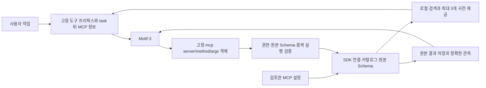

# Motif-3 MCP 어댑터 구현·검증 기록

2026-09-25 · `mcp-adapter` 브랜치 · npm 0.3.4 원본에서 구현

이 문서는 제품 코드, 실제 공개 MCP 서버를 사용한 Motif-3 작업, 결정적인 회귀 테스트를 구분해서 기록한다. 모형 내부 구조에 대한 추정으로 최적화를 정당화하지 않고 실제 호출과 생성 파일, 서버 저장 상태를 근거로 삼았다. 모든 MCP 서버·모든 작업에서 최적임을 입증한 결과는 아니다.

## 기준 버전과 실행 범위

- npm `motifcode@0.3.4`의 `gitHead`와 `v0.3.4` 태그를 대조했다. 둘 다 `4570d635a6776c12ce281ddeed3aa607ed00a924`다.
- 별도 클론의 `mcp-adapter` 브랜치에 구현했다. 실험은 별도 scratch 경로에서 진행했다.
- 글로벌 Motifcode 설치, 개인 MCP 설정, npm 배포, GitHub/Discord 상태는 변경하지 않았다.
- 실제 모델은 기존 자격증명으로 접근한 `motif/motif-3`다. 자격증명은 증거에 기록하지 않았다. reasoning은 실제 이력에 보존하지만 실험 파일에는 길이만 남겼다.
- 기존 프로토콜·실행기·권한 정책·전체 9개 도구를 사용하는 `runLoop`에서 실행했다. 다른 도구를 숨겨서 MCP 사용을 강제하지 않았다. 네이티브 도구로 우회하면 별도 실패로 집계한다.

## 구현한 구조

기존 연구의 세 필드 object 프록시를 채택했다. `args`를 JSON 문자열로 한 번 더 감싸지 않으므로 한글·따옴표·개행·역슬래시를 이중 이스케이프할 필요가 없다. 원격 도구마다 native tool을 새로 추가하지 않으며, 기존 정규 순서를 유지한다. 시스템 프롬프트와 도구 블록은 안정적으로 유지하고 변경 가능한 스키마 카드는 작업 뒤에 붙인다.

호스트는 모델 호출 없이 이름·설명·필드를 검색한다. 관련 스키마 최대 3개를 처음에 주고, 명시적인 검색은 최대 8개를 반환한다. 스키마를 임의로 평탄화하거나 타입·필드를 줄이지 않는다. 한국어 기능어와 영어 변화형은 검색에만 사용하고 실제 서버·도구·인자 이름은 바꾸지 않는다.

출력은 기본 16,000바이트 안에서 작은 결과를 그대로 전달한다. 큰 결과는 원본을 저장하고 정확한 JSON Pointer, 줄, 문자 범위 또는 literal 검색으로 조회한다. 사용자 작업에서 추출한 최대 6개 원문 문구가 결과에 실제로 있으면 위치·일치 수·발췌를 먼저 보여준다. 이 과정에 추가 LLM 요청이나 생성 요약은 없다. 모든 발췌는 부분 결과이며, 전체 성공 판정과 구분한다.

## 실험에서 발견해 고친 문제

| 관측 | 반영한 수정 |
| --- | --- |
| Playwright 과제에서 `navigation` 검색이 `navigate`와 연결되지 않고 초기 후보에 form 도구가 빠짐 | 영어 변화형과 한국어 기능어 검색, 작은 도구 이름 목록, 명시 검색의 카드 수 보완 |
| 큰 결과 handle을 파일 경로로 오해하고 native read를 시도 | opaque 메모리 ID임을 표시하고 실제 가능한 다음 조회 형태를 제공 |
| 한 줄 JSON 결과에 줄 단위 조회를 권해 불필요한 실패 발생 | 긴 단일 행에는 문자 범위 조회 안내 |
| 긴 문서의 앞부분을 수차례 순서대로 읽으며 최종 답변 전에 예산 소진 | 원문 task 문구의 정확한 검색 결과를 선제 제공; 부분 범위·위치·일치 수 보존 |
| Memory의 `open_nodes`에 `nodes`, `entities`를 추측해 제출 | 실행 전 차단하고 누락된 원래 필드명, 예산 내 원본 스키마, describe 복구 경로 제공 |
| MCP business error가 transport 성공과 혼동될 수 있음 | `isError`를 실행기 실패로 전파하고 원본 결과와 실행 상태를 별도로 보존 |
| 응답 유실된 쓰기를 새 child scope에서 재시도 가능 | 동일 연결 관리자의 모든 scope에서 unknown/in-flight 호출을 공유하여 중복 차단 |
| 조작된 매우 긴 JSON key가 오류 응답 예산을 초과 | JSON 바이트 기준 오류 필드 제한과 최종 envelope 예산 방어 |
| import의 환경변수 fallback에 inline secret이 숨을 수 있음 | 가져올 때 fallback 값 제거 및 추가 설정 필요 진단 |
| emoji 중간을 자르는 문자 조회가 진전 없는 페이지를 만들 수 있음 | surrogate 경계 검증, 진행 불가능한 범위에 명시 오류 |
| SIGTERM 시 stdio 자식 프로세스가 남음 | 모델/도구 중단 신호를 전파하고 연결 종료를 await; doctor 초기화 중 종료도 적용 |
| 소스 테스트는 통과하지만 bundle에서 CommonJS 내장 모듈 로딩 실패 | self-contained ESM bundle에 Node createRequire 연결 |
| Node 20.0에 필요한 AbortSignal.any 없음 | 실제 동작을 확인한 Node 20.3.0 이상으로 engine 요구사항 명시 |

## 공개 서버 실사용

Filesystem 및 Memory는 `2026.8.31`, Playwright MCP는 `0.0.82`로 고정했다. OpenAI Docs MCP는 실제 공개 HTTP 서비스이므로 서버 배포 버전과 검색 색인은 통제하지 못한다. 브라우저 작업은 실제 Chrome과 로컬 테스트 양식을 사용했으며 외부 주문이나 결제를 만들지 않았다.

최종 보정 코드(`ff457c9f8afbe53a04ad87d27109892b625c757567783ed111fafea1469e3d35`)에서 수행한 확인은 아래와 같다. Filesystem/Memory는 seed 101·102, 나머지는 아래 표의 반복 수다.

| 작업 | 엄격 성공 | 실제 확인한 결과 | 모델 요청 |
| --- | ---: | --- | ---: |
| Filesystem MCP | 2/2 | 한글·emoji·따옴표·실제 개행·역슬래시·셸 특수문자를 포함한 133바이트 파일 저장 후 다시 읽기; 원본과 바이트 일치 | 각 3회 |
| Memory MCP | 2/2 | 엔티티 2개와 관계 생성, open_nodes로 재조회; JSONL 저장값과 관측값 일치 | 각 4회 |
| OpenAI Docs MCP (HTTP) | 1/1 | 공식 문서에서 전송 방식 2개와 allowed_tools 확인, 실제 근거 URL 인용 | 9회 |
| Playwright MCP + Chrome | 1/2 | 성공 건은 한국어 양식 입력·제출 후 접수번호 OPENLAB-2701와 8,103원 확인; 서버 저장값까지 일치 | 성공 7회 / 실패 1회 |
| 긴 결과의 부정 사례 (별도 SDK fixture) | 1/1 | 약 57KB 로그 뒤의 decision을 직접 읽고 approved=false, blocker=회귀-918, failedTests=3을 근거로 배포 불가 판단 | 3회 |

마지막 확인 **8회 중 7회**가 엄격한 판정을 통과했다. Playwright 실패 건은 모델이 호출할 JSON을 일반 답변의 코드 블록에 적고 끝냈으며, 실제 MCP 호출과 주문 생성은 0회다. 이를 실행 성공으로 세지 않았다. 일반 답변의 예시 JSON을 실행 명령으로 임의 승격시키는 보정도 넣지 않았다.

브라우저 과제의 이전 반복에서는 MCP가 반환한 snapshot 파일을 native read로 읽는 우회, `e6`를 `[ref=e6]` 등으로 바꾼 잘못된 선택자 사용도 관측했다. 참조값 복사와 MCP-only 조회 안내를 추가한 후 성공 건에서는 navigate → snapshot → fill_form → click → snapshot으로 마무리했다. 이 안내가 모델의 모든 형식 오류를 해소한다는 근거는 아니다.

긴 문서 과제는 초기 8·12턴 실행에서 끝내지 못했다. 정확한 task 문구의 원문 발췌를 먼저 제공한 첫 확인은 5회·24.5초에 완료됐고, 마지막 확인은 9회·58.6초에 완료됐다. 두 결과와 실패 기록을 모두 보존했다. 첫 성공 수치만 일반적인 처리시간으로 제시하지 않는다.

## 비교 방법과 해석 기준

`prefetch`, `catalog`, `search` 모두 같은 native 9개 도구, 같은 모델·샘플링·원본 서버·업무 프롬프트를 사용한다. 차이는 처음에 제공하는 MCP 스키마다. `catalog`는 64 KiB 한도 안의 전체 스키마, `search`는 제어 스키마와 이름 목록, `prefetch`는 관련 원본 스키마 최대 3개를 제공한다.

모드별 같은 seed 101/102를 사용하고 두 번째 seed에서는 순서를 뒤집었다. 실행 전에 해당 과제가 생성한 파일만 초기화하고 실제 결과 사본을 남겼다. 코드를 고정한 최종 비교는 source SHA를 매 실행 전에 검증한다. 서버 데이터 정확성, 필수 MCP 호출, 지시한 도구만 사용했는지, 최종 완료 여부를 별도로 판정한다.

캐시는 강제로 비우지 않았다. seed 결정성, 제공자 배치·부하·캐시 상태를 통제하지 못한다. 비교 작업은 한 번에 하나씩 실행했지만 별도 Docs/브라우저 확인 작업이 최대 하나 동시에 실행됐다. 따라서 벽시계 지연은 관측치이며 인과적인 속도 향상 증명이 아니다. 토큰은 제공자가 응답에 보고한 수치이며 요청별 입력 합계와 캐시 토큰을 함께 기록한다.

보정 전 동일 코드를 고정한 12회 비교 결과다. 각 모드는 Filesystem/Memory × seed 2개로 4회다. 입력/출력/캐시는 **episode당 보고 토큰 합계의 평균**, 시간은 시작부터 정리까지 벽시계 평균이다.

| 조건 | 엄격 성공 | 평균 모델 요청 | 입력 토큰 | 출력 토큰 | 캐시 입력 | 평균 시간 |
| --- | ---: | ---: | ---: | ---: | ---: | ---: |
| 관련 스키마 사전 제공 | 4/4 | 4.25 | 19,350 | 1,838 | 13,696 | 34.5초 |
| 전체 스키마 제공 | 4/4 | 3.50 | 17,553 | 1,486 | 11,872 | 23.7초 |
| 검색부터 시작 | 3/4 | 7.00 | 44,822 | 4,460 | 32,512 | 74.7초 |

이 비교에서는 **전체 스키마 방식이 초기 사전 제공보다 빨랐고 입력 토큰도 적었다.** 원인을 조사하니 Memory 요청에 `open_nodes`를 명시했는데도 payload 단어와 겹치는 `add_observations`를 더 높게 골랐다. 도구 전체 식별자의 명시적 언급을 설명 단어보다 우선하도록 보정했다. 한국어 조사가 붙거나 숫자·점이 있는 이름도 회귀 테스트로 확인했다.

보정한 기본 모드를 같은 4개 과제에 다시 실행한 결과는 **4/4 성공, 평균 요청 3.5회, 입력 14,244토큰, 출력 1,265토큰, 캐시 6,816토큰, 25.3초**다. Memory 두 반복 모두 원격 호출 3회와 최종 답변 1회로 끝났다. 이전 전체 스키마 방식의 평균 3.5회 왕복과 같은 수준에서 총 입력을 약 19% 줄인 관측이다. 다만 전체 스키마의 23.7초보다 빠르지는 않았고 캐시 적중량도 달랐다. **후속 4회는 코드와 실행 시점이 다른 확인 실험이지, 기존 12회와 합쳐 통계적 우월성을 주장할 수 있는 새 무작위 비교가 아니다.**

검색 전용의 한 실패는 필요한 원격 쓰기·읽기를 모두 호출했지만 최종 파일이 131바이트로 원문과 달랐고 native 도구로 우회하다 10턴 예산을 소진했다. 서버 호출 횟수만으로 성공을 판단하면 놓치는 결함이다.

초기 튜닝 중 6턴 제한의 12회 기록도 따로 남겼다. 엄격 성공은 7/12, 필수 원격 워크플로는 10/12, 저장 결과 일치는 11/12였지만 이 도중 소스가 바뀌었으므로 모드 우열의 근거로 사용하지 않는다. 기계가 읽을 수 있는 [episode별 결과와 SHA](mcp-evaluation.json)에 고정 비교와 후속 확인을 분리했다.

## 결정적 테스트와 배포 아티팩트

- 전체 TypeScript 검사 통과.
- 도구 스키마 linter 통과.
- **58개 파일, 862개 테스트 통과.** 기존 테스트와 MCP 통합·회귀 테스트를 포함한다.
- 실제 SDK stdio·legacy SSE·legacy/modern HTTP, pagination, list_changed, 원본 Schema 검증, business error, timeout/cancel, 응답 유실 시 중복 금지, 자격증명·승인 격리, trust/import, 결과 scope/TTL/예산을 검증했다.
- 단일 bundle 빌드 및 로컬 npm tarball 생성 완료. 저장소 밖의 설치본에서 Node **20.3.0 및 20.20.2**로 stdio·HTTP 연결을 확인했고 자식 프로세스 잔류가 없었다.
- 최종 CLI bundle은 **1,869,454바이트**, tarball은 **408,307바이트**다. CLI는 번들에 의존성을 포함하므로 별도 runtime npm 의존성을 설치하지 않는다.
- 아티팩트 SHA-256: bundle `864a2a2526b2d1f901f3a81374f6db38836b61ab4b20cd8667c371f5ea1b072a`, tarball `848812eefa40242290abebc54fb77bd501076161b006acb58f4d7f55e84817e8`.

실제 PTY + xterm/headless로 interactive Ctrl-C 후 취소·서버 종료·입력창 복귀·Ctrl-D 정상 종료를 확인했다. headless SIGTERM도 서버 종료와 exit 143을 확인했다. doctor 초기화 중 SIGINT/SIGTERM/SIGHUP의 종료 코드는 각각 130/143/129이며 프로세스가 남지 않는 회귀 테스트가 있다. 이 테스트는 단순히 escape 문자를 문자열 비교한 것이 아니라 실제 터미널 인터페이스와 프로세스 상태를 검사했다.

테스트는 원격 모델 응답의 정확성을 보증하지 않는다. 실제 Motif-3가 지시한 도구를 벗어나거나, 필요한 호출을 응답 텍스트로만 쓰거나, 제공된 스키마를 놓치는 실패는 독립적으로 보고한다.

## 남은 범위

이 구현은 MCP **tools** 어댑터다. stdio·Streamable HTTP·명시적 legacy SSE, static credential 연결, 일반적인 Codex TOML/Claude JSON 설정 가져오기를 지원한다. OAuth 로그인/갱신, resources/prompts/roots, sampling/elicitation, tasks, MCP Apps, 이미지·오디오의 모델 멀티모달 전달은 이번 구현 범위에 포함하지 않는다. 해당 기능이 필수인 서버까지 완전히 호환된다고 주장하지 않는다.

부분 정보로 전체를 단정하지 않도록 범위와 조회 경로를 제공했지만, 모델의 최종 문장에 대한 자동 진실 판정기는 아니다. 결과 handle은 현재 실행의 scope와 수명에 묶이며 재시작 후 사라진다. timeout 후 외부 쓰기가 실제로 완료됐는지는 자동으로 판단할 수 없으므로 unknown으로 남기고 자동 재시도를 금지한다.

현재 기본값은 일반적인 도구 접근에서 추가 검색 왕복을 줄이도록 선택했다. 작은 표본의 승률이나 특정 한 번의 속도만으로 모든 서버에서 가장 빠르거나 정확하다고 결론 내리지 않는다. 새 서버에 대해서는 동일 harness와 실제 업무·독립적인 정답 검증으로 회귀를 확인해야 한다.

설정·실행 방법은 [MCP 사용 문서](mcp.md), 재현용 프로그램은 [mcp-live-eval.ts](../scripts/mcp-live-eval.ts)에 있다. `--help`에 필요한 입력 파일과 실행 옵션이 정리되어 있다.
